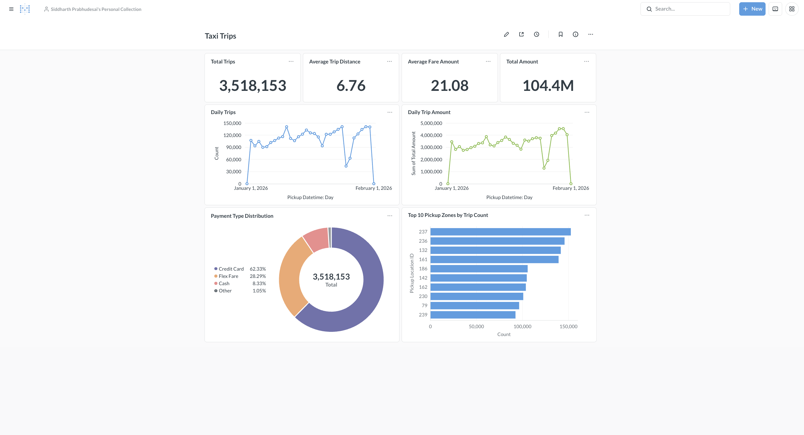
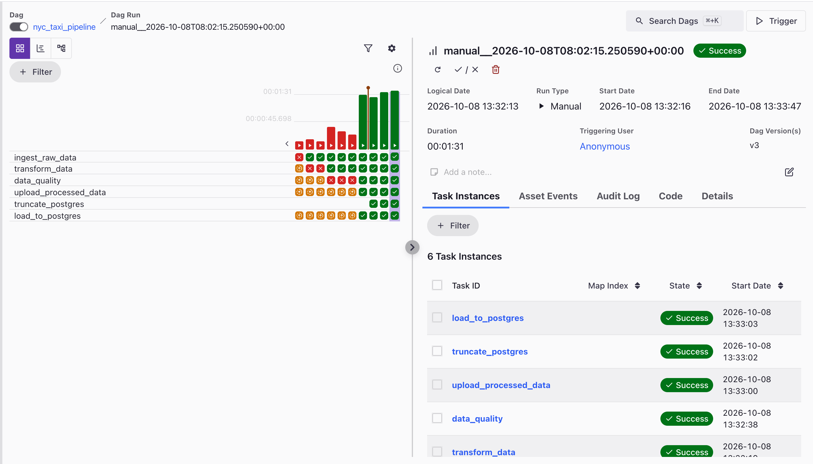

# NYC Taxi Data Pipeline

A local batch ETL pipeline for processing NYC TLC Yellow Taxi trip data using **Apache Airflow, PySpark, MinIO, PostgreSQL, Docker, and Metabase**.

The project demonstrates a complete data engineering workflow:

```text
NYC TLC Parquet
      ↓
Airflow
      ↓
MinIO / Raw
      ↓
PySpark Transformation
      ↓
Data Quality
      ↓
MinIO / Processed
      ↓
PostgreSQL
      ↓
Metabase Dashboard
```

---

## 1. Overview


This project processes the **NYC TLC Yellow Taxi January 2026 dataset**.

The pipeline is implemented as a manually triggered Airflow batch DAG and performs:

* Raw data ingestion
* Parquet processing with PySpark
* Data cleaning and transformation
* Data-quality validation
* Raw/processed storage in MinIO
* Loading cleaned data into PostgreSQL
* Analytics and visualization using Metabase

The project runs locally using Docker/Astro and does not require cloud infrastructure or billing.

---

## 2. Dataset Overview

**Dataset:** NYC TLC Yellow Taxi Trip Data — January 2026

**File:**

```text
yellow_tripdata_2026-01.parquet
```

**Raw dataset:**

* Rows: **3,724,889**
* Columns: **20**
* Format: **Apache Parquet**

Important columns include:

```text
VendorID
tpep_pickup_datetime
tpep_dropoff_datetime
passenger_count
RatecodeID
store_and_fwd_flag
PULocationID
DOLocationID
payment_type
fare_amount
extra
mta_tax
tip_amount
tolls_amount
improvement_surcharge
total_amount
congestion_surcharge
Airport_fee
cbd_congestion_fee
```

After transformation:

* Final rows: **3,518,153**
* Removed invalid records: **206,736**
* Null values in validated fields: **0**
* Duplicate records: **0**

---

## 3. File Structure

```text
nyc-taxi-data-pipeline/
│
├── dags/
│   └── nyc_taxi_pipeline.py
│
├── Scripts/
│   ├── upload_to_minio.py
│   ├── transform_taxi_data.py
│   ├── data_quality.py
│   ├── upload_processed_to_minio.py
│   ├── truncate_postgres.py
│   ├── create_postgres_table.py
│   ├── load_to_postgres.py
│   └── inspect_taxi_data.py
│
├── Dockerfile
├── docker-compose.yml
├── packages.txt
├── requirements.txt
├── .gitignore
│
├── yellow_tripdata_2026-01.parquet
└── README.md
```

### Main components

| Component            | Purpose                                 |
| -------------------- | --------------------------------------- |
| `dags/`              | Airflow DAG definitions                 |
| `Scripts/`           | ETL, validation and database scripts    |
| `Dockerfile`         | Custom Airflow image configuration      |
| `docker-compose.yml` | PostgreSQL, MinIO and Metabase services |
| `packages.txt`       | System packages such as Java            |
| `requirements.txt`   | Python dependencies                     |
| Parquet file         | Source NYC Taxi dataset                 |

---

## 4. Setup Commands

### Start the Astro/Airflow environment

```bash
astro dev start
```

Airflow UI:

```text
http://localhost:8080
```

### Start project services

```bash
docker compose up -d
```

Services:

```text
PostgreSQL → localhost:5432
MinIO      → localhost:9000
MinIO UI   → localhost:9001
Metabase   → localhost:3000
Airflow    → localhost:8080
```

### Check containers

```bash
docker ps
```

### Check Compose configuration

```bash
docker compose config
```

### Restart project services

```bash
docker compose restart nyc-postgres minio metabase
```

### Stop services

```bash
docker compose stop
```

> Avoid `docker compose down -v` when you want to preserve PostgreSQL, MinIO or Metabase data.

---

# 5. Pipeline Flow


The Airflow DAG executes the following sequence:

```text
1. ingest_raw_data
        ↓
2. transform_data
        ↓
3. data_quality
        ↓
4. upload_processed_data
        ↓
5. truncate_postgres
        ↓
6. load_to_postgres
```

### 1. Ingest

`upload_to_minio.py`

Uploads the raw Parquet file to:

```text
MinIO
└── nyc-taxi
    └── raw/
        └── yellow_tripdata_2026-01.parquet
```

### 2. Transform

`transform_taxi_data.py`

PySpark reads the raw Parquet file and produces cleaned/derived data.

### 3. Data Quality

`data_quality.py`

Checks:

* Null values
* Row count
* Duplicate records
* Invalid trip duration
* Invalid distance
* Negative fares
* Negative total amounts
* Abnormally high speeds

### 4. Upload processed data

`upload_processed_to_minio.py`

Stores the processed Parquet data:

```text
MinIO
└── nyc-taxi
    └── processed/
        └── yellow_tripdata_2026-01/
```

### 5. PostgreSQL refresh

`truncate_postgres.py`

Clears the previous table contents before loading the new batch.

This makes the current implementation a **full-refresh batch pipeline**, not an incremental pipeline.

### 6. Load

`load_to_postgres.py`

Loads the processed Parquet data into:

```text
PostgreSQL
└── nyc_taxi
    └── taxi_trips
```

Final loaded records:

```text
3,518,153
```

---

# 6. Transformations Done

### Trip duration

Calculated from pickup and drop-off timestamps:

```text
trip_duration_minutes
```

```text
(dropoff time - pickup time) / 60
```

### Invalid trip removal

Records are removed when:

```text
trip_duration <= 0
trip_distance <= 0
fare_amount < 0
total_amount < 0
```

This removed:

```text
206,736 records
```

### Missing-value handling

Domain-based defaults are applied:

| Column                 | Default |
| ---------------------- | ------: |
| `passenger_count`      |       1 |
| `RatecodeID`           |      99 |
| `store_and_fwd_flag`   |       N |
| `congestion_surcharge` |       0 |
| `Airport_fee`          |       0 |
| `cbd_congestion_fee`   |       0 |

### Average speed

A derived metric is calculated:

```text
average_speed_mph =
trip_distance / (trip_duration_minutes / 60)
```

### Rounding

Derived metrics are rounded to **2 decimal places**:

```text
trip_duration_minutes
average_speed_mph
```

---

# 7. Dashboard Metrics & Visuals


The **NYC Taxi Dashboard** contains 8 cards/visuals.

| Visual                        | Purpose                                      | View                 |
| ----------------------------- | -------------------------------------------- | -------------------- |
| **Total Trips**               | Shows overall number of processed taxi trips | Number               |
| **Average Fare**              | Shows typical fare amount per trip           | Number               |
| **Average Trip Distance**     | Shows average distance travelled             | Number               |
| **Total Trip Amount**         | Shows total revenue/amount across trips      | Number               |
| **Daily Trips**               | Shows how trip volume changes by day         | Line chart           |
| **Daily Trip Amount**         | Shows daily monetary trend                   | Line chart           |
| **Payment Type Distribution** | Shows how passengers paid                    | Pie chart            |
| **Top 10 Pickup Zones**       | Shows locations with highest trip volume     | Horizontal bar chart |

### Why these visuals?

**KPI cards** provide a quick summary of the dataset.

**Daily Trips** helps identify changes in demand over time.

**Daily Trip Amount** shows how the monetary value of trips changes across the month.

**Payment Type Distribution** provides a breakdown of payment methods.

**Top 10 Pickup Zones** identifies the locations generating the highest number of trips.

The dashboard therefore covers:

```text
Overall volume
      +
Financial metrics
      +
Time trends
      +
Payment behaviour
      +
Location demand
```

> `PULocationID` currently represents TLC taxi-zone IDs. A future improvement would be joining the official Taxi Zone lookup to display zone names instead of IDs.

---

# 8. Metabase Components

Metabase is the **BI and visualization layer** of the project. It connects directly to PostgreSQL and queries the processed `taxi_trips` table.

### Database

Metabase connects to:

```text
Database: nyc_taxi
Host: host.docker.internal
Port: 5432
User: nyc_user
Table: taxi_trips
```

### Questions

In Metabase, each individual chart/KPI is created as a **Question**.

Examples:

```text
Count of rows
Average fare_amount
Average trip_distance
Sum of total_amount
Count by pickup date
Sum total_amount by pickup date
Count by payment_type
Count by PULocationID
```

### Custom Expression

Payment type IDs are converted into meaningful labels:

```text
0 → Flex Fare
1 → Credit Card
2 → Cash
3 → No Charge
4 → Dispute
5 → Unknown
6 → Voided Trip
```

This makes the visualization understandable instead of displaying only numeric codes.

### Dashboard

The individual Metabase Questions are combined into:

```text
NYC Taxi Dashboard
```

The dashboard provides a single analytical view of the processed dataset.

### Metabase persistence

Metabase uses a Docker volume:

```text
nyc-taxi-data-pipeline_metabase_data
```

This preserves dashboards and Metabase configuration when the container is restarted.

---

## Tech Stack

```text
Python
PySpark
Apache Airflow
Astro Runtime
Docker / Docker Compose
MinIO
PostgreSQL
Metabase
Apache Parquet
```

**Overall:** this project demonstrates a complete local **batch data engineering pipeline — ingestion → storage → transformation → data quality → database loading → BI visualization**.
